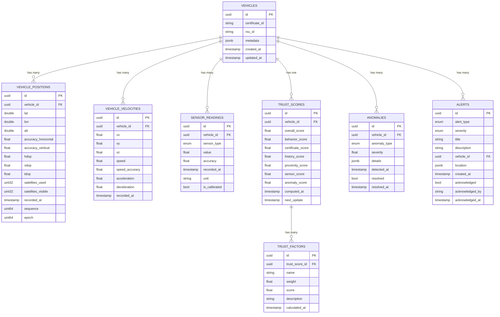

# GeoVAN System Architecture

This document provides a comprehensive overview of the GeoVAN system architecture, including detailed diagrams, component descriptions, and design decisions.

## 🏗️ System Overview

GeoVAN is a microservices-based VANET platform designed for high performance, security, and scalability. The system processes real-time vehicle data with cryptographic validation, trust scoring, and anomaly detection.

## 🔄 High-Level Architecture


## 🔐 Security Architecture

### Cryptographic Flow


### Trust Scoring Algorithm


## 📊 Data Flow Architecture

### Real-time Message Processing


### Database Schema



## 🚀 Performance Architecture

### Scalability Design


### Caching Strategy


## 🔒 Security Implementation

### Authentication Flow


### Certificate Validation


## 📈 Monitoring & Observability

### Metrics Collection


### Logging Architecture


## 🌐 Network Architecture

### Network Topology


### Load Balancing Strategy


## 🔄 Deployment Architecture

### Container Orchestration


### CI/CD Pipeline


## 📊 Data Processing Pipeline

### Stream Processing


### Batch Processing


## 🔧 Configuration Management

### Environment Configuration


## 🚀 Performance Optimization

### Database Optimization


### Caching Strategy


## 🔒 Security Hardening

### Network Security

```mermaid
graph TB
    A[External Request] --> B[WAF]
    B --> C[DDoS Protection]
    C --> D[Rate Limiting]
    D --> E[Authentication]
    E --> F[Authorization]
    F --> G[API Gateway]
    
    subgraph "Security Layers"
        H[Network Layer]
        I[Transport Layer]
        J[Application Layer]
        K[Data Layer]
    end
    
    G --> H
    H --> I
    I --> J
    J --> K
```

### Data Protection

```mermaid
graph TD
    A[Sensitive Data] --> B[Encryption at Rest]
    B --> C[Encryption in Transit]
    C --> D[Access Control]
    D --> E[Audit Logging]
    
    subgraph "Protection Methods"
        F[AES-256 Encryption]
        G[TLS 1.3]
        H[Role-based Access]
        I[Data Masking]
    end
    
    E --> F
    E --> G
    E --> H
    E --> I
```

## 📈 Scalability Patterns

### Horizontal Scaling

```mermaid
graph TB
    A[Load Balancer] --> B[Service Instance 1]
    A --> C[Service Instance 2]
    A --> D[Service Instance N]
    
    B --> E[Database Cluster]
    C --> E
    D --> E
    
    subgraph "Scaling Triggers"
        F[CPU Usage > 80%]
        G[Memory Usage > 80%]
        H[Response Time > 500ms]
        I[Queue Length > 1000]
    end
    
    F --> J[Scale Up]
    G --> J
    H --> J
    I --> J
```

### Auto-scaling

```mermaid
graph TD
    A[Monitor Metrics] --> B{Threshold Exceeded?}
    B -->|No| A
    B -->|Yes| C[Scale Decision]
    
    C --> D{Scale Up or Down?}
    D -->|Up| E[Add Instances]
    D -->|Down| F[Remove Instances]
    
    E --> G[Update Load Balancer]
    F --> G
    
    G --> H[Monitor Performance]
    H --> A
```

This architecture provides a robust, scalable, and secure foundation for the GeoVAN system, enabling it to handle thousands of vehicles with sub-millisecond latency while maintaining cryptographic integrity and privacy protection.
